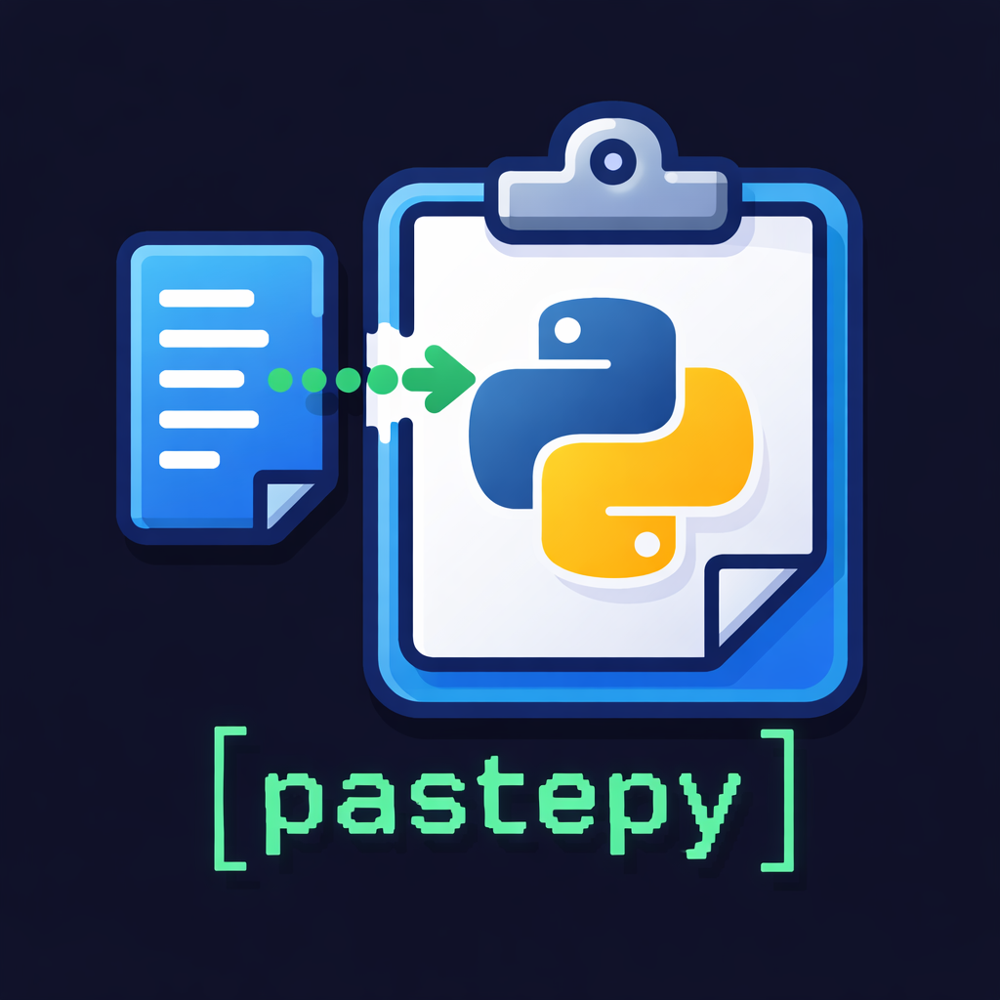

<p align="center">
  
</p>

# pastepy

> Copy. Paste. Done.
>
> No pip. No install. Standard library only.

pastepy is a collection of **zero-dependency, copy-pasteable Python modules**
for edge devices, restricted environments, and real-world scripts.

## 中文簡介

pastepy 是一組 **零依賴、可直接複製貼上使用的 Python 單檔工具**，
面向 edge devices、embedded systems、無法安裝套件的受限環境，以及
edge AI / streaming ASR 相關應用。

核心目標：

- 不需要 `pip install`
- 只使用 Python standard library
- 每個模組都是獨立單檔
- 可以直接複製到其他專案或設備上使用
- 適合低資源、離線、部署受限的環境

目前功能涵蓋：

- Core MVP：HTTP、retry、LRU cache、env loader、rate limit
- Practical utilities：CLI、logging、file IO、JSON、CSV、ZIP、path helpers
- 檔案、JSON、CSV、ZIP、路徑、atomic write、file lock
- Experimental edge expansion：SRT / VTT 字幕、WAV / PCM16 音訊、ASR transcript cleanup
- streaming ASR partial/final text、endpointing、speaker turns
- embedding/vector helpers、model output post-processing、model manifest
- device probe、OTA markers、network checks、resource policy

完整分類索引請看 [docs/feature_index.md](docs/feature_index.md)。

## The Problem

Sometimes `pip install` is not available:

- no wheels for the CPU architecture
- no compiler for C extensions
- no internet access
- locked-down production systems
- throwaway scripts that still need reliable behavior

pastepy keeps useful building blocks small enough to copy into one file and run.

## What This Is

- single-file Python utilities
- standard library only
- no shared internal package
- designed for copy-paste use
- clear limitations instead of hidden magic

Example:

```python
from simple_http import get

res = get("https://example.com", timeout=3)
print(res.status, res.text)
```

## Design Principles

Every module should follow these rules:

- **Zero dependencies:** standard library only.
- **Copy-paste first:** one file should work on its own.
- **Edge-ready:** low startup cost, small memory footprint, predictable behavior.
- **Production-aware:** safe defaults and explicit limitations.
- **Small and focused:** one file, one job.
- **Self-tested:** each module has a direct `if __name__ == "__main__"` check.

See [docs/design.md](docs/design.md) for the full rules.

## Core MVP

The core MVP is the stable front door of pastepy. Start here if you want the
smallest useful set of copy-paste tools:

| Need | File | Why |
| --- | --- | --- |
| HTTP requests | [http/simple_http.py](http/simple_http.py) | Minimal GET/POST with timeout, retry, and JSON helpers. |
| Retry logic | [retry/backoff.py](retry/backoff.py) | Simple exponential backoff for unstable calls. |
| Small cache | [cache/lru.py](cache/lru.py) | Fixed-size LRU cache for repeated work. |
| Config | [config/env_loader.py](config/env_loader.py) | Tiny `.env` loader with override support. |
| Rate limiting | [rate_limit/token_bucket.py](rate_limit/token_bucket.py) | Token bucket limiter for APIs and device actions. |

These modules are intentionally small and should remain conservative.

## Module Maturity

pastepy has grown beyond the initial MVP. To keep the project focused, modules
are grouped by maturity:

- **Core MVP:** stable, front-page modules that define the project.
- **Practical utilities:** general-purpose helpers that are useful but secondary.
- **Experimental edge expansion:** edge AI / ASR / model ops helpers that are
  useful for specialized deployments and may be refined more aggressively.

See [docs/maturity.md](docs/maturity.md) for the full policy.

## Full Module Index

pastepy currently includes 41 single-file modules and 311 public entry points.

For a searchable-by-category overview, see
[docs/feature_index.md](docs/feature_index.md).

### HTTP

- [http/simple_http.py](http/simple_http.py): minimal GET/POST client with timeout, retry, and JSON helpers.

### CLI

- [cli/args.py](cli/args.py): tiny parser for flags, positional arguments, and env fallbacks.

### Retry

- [retry/backoff.py](retry/backoff.py): simple function retry with exponential backoff.

### Cache

- [cache/lru.py](cache/lru.py): fixed-size least-recently-used cache.
- [cache/ttl_cache.py](cache/ttl_cache.py): fixed-size cache with time-based expiry.

### Rate Limiting

- [rate_limit/token_bucket.py](rate_limit/token_bucket.py): token bucket limiter with `allow()` and `wait()`.

### Config

- [config/env_loader.py](config/env_loader.py): small `.env` loader.

### CSV

- [csv_tools/csv_rows.py](csv_tools/csv_rows.py): read, write, append, and inspect CSV rows.

### Experimental Edge AI / ASR

These modules are intentionally marked experimental. They are still
copy-pasteable and self-tested, but they cover specialized edge AI workflows
and may change faster than the Core MVP.

- [asr/streaming_text.py](asr/streaming_text.py): partial/final transcript normalization, stabilization, merge, display, wrapping, and context trimming.
- [asr/endpointing_tools.py](asr/endpointing_tools.py): frame sizing, speech/silence thresholds, endpoint detection, and flush timing helpers.
- [asr/diarization_tools.py](asr/diarization_tools.py): speaker-tag word normalization, speaker turns, labels, durations, overlaps, and relabeling.
- [stream/chunk_tools.py](stream/chunk_tools.py): audio chunk sizing, sequencing, missing packet checks, latency, jitter, RTF, and backpressure helpers.
- [edge/resource_policy.py](edge/resource_policy.py): low-resource policy helpers for memory, disk, latency, battery, thermal, model choice, and degradation mode.
- [subtitles/subtitle_tools.py](subtitles/subtitle_tools.py): parse, write, convert, shift, and merge SRT/VTT cues.
- [audio/wav_tools.py](audio/wav_tools.py): inspect, write, split, and measure PCM WAV audio.
- [audio/pcm_tools.py](audio/pcm_tools.py): raw PCM16 helpers, silence trim, gain normalize, energy VAD, and speech segments.
- [ai/transcript_tools.py](ai/transcript_tools.py): normalize, clean, chunk, search, and redact ASR transcripts.
- [ai/vector_tools.py](ai/vector_tools.py): small embedding/vector helpers without NumPy.
- [ai/output_tools.py](ai/output_tools.py): classifier and detector output post-processing.
- [model/manifest_tools.py](model/manifest_tools.py): model manifest, checksum, version, compatibility, rollback, and rollout helpers.
- [model/metrics_tools.py](model/metrics_tools.py): accuracy, precision, recall, F1, label distribution, voting, and drift helpers.
- [sensor/sensor_tools.py](sensor/sensor_tools.py): sensor CSV, timestamp, gap, window, calibration, outlier, and downsample helpers.
- [vision/image_tools.py](vision/image_tools.py): tiny PPM/PGM image IO, grayscale, crop, resize, tiling, and box helpers.
- [dataset/jsonl_tools.py](dataset/jsonl_tools.py): JSONL read/write/append/filter/split helpers for local data capture.
- [device/system_probe.py](device/system_probe.py): platform, CPU, disk, memory, Python, and env probes.
- [ops/device_ops.py](ops/device_ops.py): PID, heartbeat, marker, config, feature flag, rollout, and diagnostic helpers.
- [update/ota_tools.py](update/ota_tools.py): OTA manifest, staged install, rollback, lock, and readiness helpers.

### Data

- [data/iter_tools.py](data/iter_tools.py): chunk, flatten, unique, group, compact, and window iterables.

### Filesystem

- [fs/atomic_file.py](fs/atomic_file.py): atomic text and bytes writes.
- [fs/file_lock.py](fs/file_lock.py): simple lock-file based cross-process lock.
- [fs/path_tools.py](fs/path_tools.py): small path helpers for directories, text files, listing, size, and cleanup.

### Logging

- [log/simple_logger.py](log/simple_logger.py): timestamped logger with level filtering and JSON-line output.

### Networking

- [net/url_tools.py](net/url_tools.py): URL join, query edit, query lookup, and HTTP URL checks.
- [net/network_checks.py](net/network_checks.py): DNS, TCP, HTTP, local IP, TLS URL, allowlist, and reconnect helpers.

### Process

- [process/run_cmd.py](process/run_cmd.py): subprocess wrapper with captured output, timeout, and executable lookup.

### Security / Hashing

- [crypto/hash_tools.py](crypto/hash_tools.py): SHA-256, HMAC-SHA256, random tokens, and constant-time compare.

### Storage

- [storage/json_store.py](storage/json_store.py): small JSON load/save helpers with atomic writes.

### Text

- [text/text_tools.py](text/text_tools.py): whitespace cleanup, slug/snake/kebab case, prefix/suffix removal, and truncation.

### Time

- [time_tools/time_tools.py](time_tools/time_tools.py): stopwatch, timestamps, duration formatting/parsing, and sleep-until.

### Validation

- [validation/checks.py](validation/checks.py): small required-key, numeric, email, URL, clamp, and choice checks.

### Archives

- [archive/zip_tools.py](archive/zip_tools.py): ZIP directory, unzip, list, add file, and ZIP detection helpers.

## When To Use pastepy

Use it when:

- you cannot install dependencies
- you are on edge or embedded systems
- you need a quick reliable utility
- you want code that is easy to inspect and adapt

Avoid it when:

- you need a full-feature framework
- you need high-performance specialized libraries
- dependency installation is safe and mature libraries fit better

## Quality Standard

Each module should include:

- purpose and use case
- features
- limitations
- usage example
- self-contained implementation
- direct self-test

## Run Self-Tests

Each module can be run directly:

```bash
python cache/lru.py
python rate_limit/token_bucket.py
python text/text_tools.py
```

No external test runner is required.

## Contributing

Keep changes small:

- no third-party dependencies
- no cross-file imports between modules
- no package architecture
- no clever abstraction for tiny utilities
- preserve the public API unless there is a strong reason

If unsure, make it simpler.

## Philosophy

> Ship less. Run everywhere.

## License

MIT
